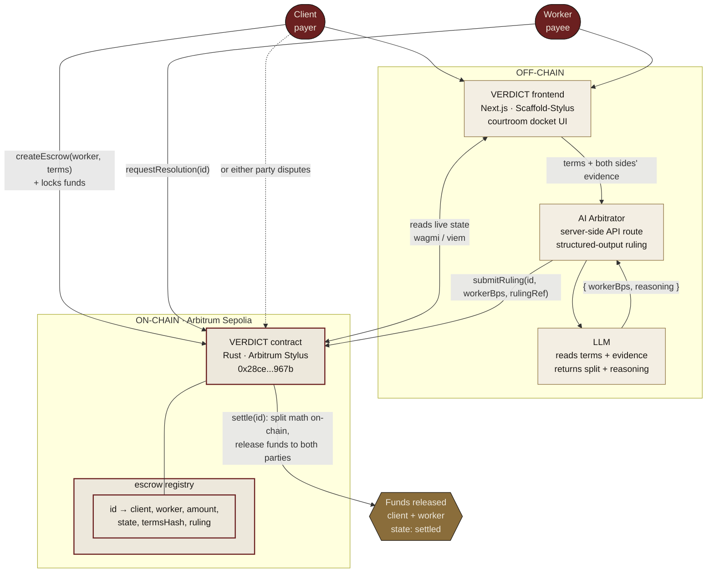

# VERDICT — Architecture



## The trust boundary

Everything inside **ON-CHAIN** is enforced by code that neither party controls and anyone can verify. The AI proposes a ruling off-chain; the contract records and enforces it on-chain. The AI can only set a split between the two real parties — it can never move funds to itself or a third party, because `settle` pays only `client` and `worker` from stored state.

## Component responsibilities

| Component | Where | Job |
|---|---|---|
| VERDICT contract | On-chain (Stylus/Rust) | Holds funds, records disputes and rulings, computes the split, releases funds. The neutral party. |
| Escrow registry | On-chain | One contract, many escrows keyed by id. |
| AI Arbitrator | Off-chain (server) | Reads terms + evidence, calls the LLM, returns a structured ruling, posts it on-chain. |
| Frontend | Off-chain (client) | Reads live contract state, drives the create → dispute → rule → settle flow, role-aware per connected wallet. |
```
