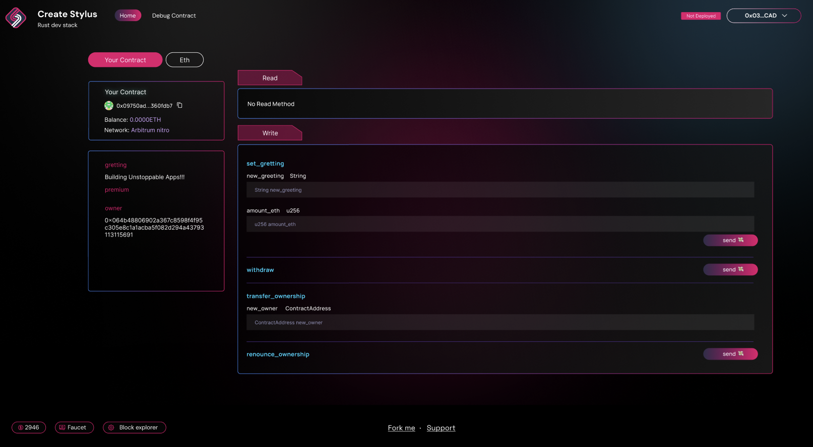

# 🏗 scaffold-stylus

<h4 align="center">
  <a href="https://arb-stylus.github.io/scaffold-stylus-docs/">Documentation</a> |
  <a href="https://scaffoldstylus.quantum3labs.com/">Website</a>
</h4>

🧪 An open-source, up-to-date toolkit for building decentralized applications (dapps) on the Arbitrum blockchain. It's designed to make it easier for developers to create and deploy smart contracts and build user interfaces that interact with those contracts.

⚙️ Built using Rust, NextJS, RainbowKit, Stylus, Wagmi, Viem, and TypeScript.

- ✅ **Contract Hot Reload**: Your frontend auto-adapts to your smart contract as you edit it.
- 🪝 **[Custom hooks](https://arb-stylus.github.io/scaffold-stylus-docs/components)**: Collection of React hooks wrapped around [wagmi](https://wagmi.sh/) to simplify interactions with smart contracts with TypeScript autocompletion.
- 🧱 [**Components**](https://arb-stylus.github.io/scaffold-stylus-docs/hooks): Collection of common web3 components to quickly build your frontend.
- 🔥 **Burner Wallet & Local Faucet**: Quickly test your application with a burner wallet and local faucet.
- 🔐 **Integration with Wallet Providers**: Connect to different wallet providers and interact with the Arbitrum network.



## Requirements

Before you begin, you need to install the following tools:

- [Node (>= v20.18)](https://nodejs.org/en/download/)
- Yarn ([v2+](https://yarnpkg.com/getting-started/install))
- [Git](https://git-scm.com/downloads)
- [Docker](https://docs.docker.com/engine/install/)
- [Foundry Cast](https://getfoundry.sh/)
- [Solc (Solidity compiler)](https://docs.soliditylang.org/en/latest/installing-solidity.html)

> **Note: Windows Compatibility**
>
> Scaffold-Stylus currently does not support Windows natively. If you're using Windows, we recommend:
>
> - **Use WSL (Windows Subsystem for Linux)** - Install WSL2 and run Scaffold-Stylus within the Linux environment
> - **Switch to Linux or macOS** - For the best development experience
>
> For WSL setup, follow the [Microsoft WSL installation guide](https://docs.microsoft.com/en-us/windows/wsl/install).

## Quickstart

To get started with Scaffold-Stylus, follow the steps below:

### 1. Install Stylus tools

First, install Rust and Cargo:

```bash
curl --proto '=https' --tlsv1.2 -sSf https://sh.rustup.rs | sh
```

Check the [Rust installation guide](https://www.rust-lang.org/tools/install) for more information.

Then install the Stylus CLI tools.

> **⚠️ WARNING:** This project requires `cargo-stylus` version `0.10.8` and `rustc` version `1.91.0` (as pinned in `packages/stylus/contracts/rust-toolchain.toml`). Do NOT use `stylusup` to install Stylus tools, as it installs the latest versions which are incompatible with these pinned requirements.

```bash
cargo install --force --locked cargo-stylus@0.10.8
```

**Prerequisite:**

- `cargo-stylus` version `0.10.8`
- `rustc` version match with `packages/stylus/contracts/rust-toolchain.toml`

Set default `toolchain` match `rust-toolchain.toml` and add the `wasm32-unknown-unknown` build target to your Rust compiler:

```bash
rustup default 1.91.0
rustup target add wasm32-unknown-unknown --toolchain 1.91.0
```

You should now have it available as a Cargo subcommand:

```bash
cargo stylus --help
```

### 2. Create a new project (recommended)

Use the interactive setup to scaffold a new project:

```bash
npx create-stylus@latest
```

Then navigate into your project directory:

```bash
cd <project-name>
yarn install
# Initialize submodules (required for Nitro dev node)
git submodule update --init --recursive
```

### 3. Clone this repo & install dependencies (alternative)

```bash
git clone https://github.com/Arb-Stylus/scaffold-stylus.git
cd scaffold-stylus
yarn install
# Initialize submodules (required for Nitro dev node)
git submodule update --init --recursive
```

### 4. Run a local network

In your first terminal:

```bash
yarn chain
```

This command starts a local Stylus-compatible network using the Nitro dev node script (`./nitro-devnode/run-dev-node.sh`). The network runs on your local machine and can be used for testing and development. You can customize the Nitro dev node configuration in the `nitro-devnode` submodule.

### 5. Deploy the test contract

In your second terminal:

```bash
yarn deploy
```

This command deploys a test smart contract to the local network. The contract is located in `packages/stylus/contracts/your-contract/src` and can be modified to suit your needs. The `yarn deploy` command uses the deploy script located in `packages/stylus/scripts` to deploy the contract to the network. You can also customize the deploy script .

### 6. Start your NextJS app

In your third terminal:

```bash
yarn start
```

Visit your app at: `http://localhost:3000`. You can interact with your smart contract using the **Debug Contracts** page, which provides a user-friendly interface for testing your contract's functions and viewing its state.

### 7. Test your smart contract

```bash
yarn stylus:test
```

## Development Workflow

- Edit your smart contract `lib.rs` in `packages/stylus/contracts/your-contract/src`
- Edit your frontend in `packages/nextjs/app`
- Edit your deployment scripts in `packages/stylus/scripts`

## Create Your Own Contract

Scaffold-Stylus enables you to create and deploy multiple contracts within a single project. Follow the steps below to create and deploy your own contracts.

### Step 1: Generate New Contract

Use the following command to create a new contract and customize it as needed:

```bash
yarn new-module <contract-name>
```

The generated contract will be located in `packages/stylus/contracts/<contract-name>`.

**Workspace structure:** `packages/stylus/contracts` is a Cargo workspace with `members = ["*"]`. `yarn new-module <name>` (via `scripts/new_module.sh`) scaffolds the new contract under `contracts/` — the glob auto-discovers it, no manual wiring needed.

### Step 2: Validate Your Contract Before Deployment

Before deploying, it's recommended to validate your contract size using `cargo stylus check`:

```bash
cd packages/stylus/contracts/<contract-name>
cargo stylus check
```

This command performs several important checks:

- **Contract size validation**: Ensures your contract doesn't exceed size limitations
- **WASM compilation**: Verifies your Rust code compiles to WebAssembly
- **Deployment hash computation**: Calculates the deployment hash
- **WASM data fee estimation**: Estimates the cost of deploying your contract

**Contract Size Indicators:**

- 🔴 **Red indicator**: Contract size exceeds limitations - **DO NOT DEPLOY**
- 🟡 **Yellow/🟢 Green indicator**: Contract size within acceptable limits - **OK to deploy**

> **Important:** When using constructors, error logs from constructor execution may not be visible. Consider using `initialize()` functions instead for better error visibility.

### Step 3: Deploy Your Contract

```bash
yarn deploy [...options]
```

This command runs the `deploy.ts` script located in `packages/stylus/scripts`. You can customize this script with your deployment logic.

**Available Options:**

- `--network <network>`: Specify which network to deploy to
- `--estimate-gas`: Only perform gas estimation without deploying
- `--max-fee=<maxFee>`: Set maximum fee per gas in gwei

**Note:** Deployment information is automatically saved in `packages/stylus/deployments` by default.

## Deploying to Other Networks

To deploy your contracts to other networks (other than the default local Nitro dev node), you'll need to configure your RPC endpoint and wallet credentials.

### Prerequisites

1. **Set the RPC URL**

   Configure your target network's RPC endpoint using the proper `RPC_URL_<network>` environment variable. You can set this in your shell or create a `.env` file (see `.env.example` for reference):

   ```env
   RPC_URL_SEPOLIA=https://your-network-rpc-url
   ```

   **Note:** If RPC URL is not provided, system will use default public RPC URL from that network

2. **Set the Private Key**

   For real deployments, you must provide your own wallet's private key. Set the `PRIVATE_KEY_<network>` environment variable:

   ```env
   PRIVATE_KEY_SEPOLIA=your_private_key_here
   ```

   **Security Note:** A development key is used by default when running the Nitro dev node locally, but for external deployments, you must provide your own private key.

3. **Set the Account Address**

   Set the `ACCOUNT_ADDRESS_<network>`

   ```env
   ACCOUNT_ADDRESS_SEPOLIA=your_account_address_here
   ```

4. **Update Frontend Configuration**

   Open `packages/nextjs/scaffold.config.ts` and update the `targetNetworks` array to include your target chain. This ensures your frontend connects to the correct network and generates the proper ABI in `deployedContracts.ts`:

   ```ts
   import * as chains from "./utils/scaffold-stylus/supportedChains";
   // ...
   targetNetworks: [chains.arbitrumSepolia],
   ```

### Arbitrum Testnet Faucets (Optional)

For Arbitrum testnets, you may need testnet ETH to deploy contracts. You can obtain testnet tokens from these faucets:

- [Chainlink Faucet](https://faucets.chain.link/arbitrum-sepolia)
- [QuickNode Faucet](https://faucet.quicknode.com/arbitrum/sepolia)
- [Alchemy Faucet](https://sepoliafaucet.com/)

### Available Networks

This template supports Arbitrum networks only. You can test which networks are available and their RPC URLs:

```bash
yarn info:networks
```

This will show you all supported networks and their corresponding RPC endpoints.

### Deploy to Other Network (Non-Orbit Chains)

Once configured, deploy to your target network:

```bash
yarn deploy --network <network>
```

**Important Security Notes:**

- The values in `.env.example` provide a template for required environment variables
- **Always keep your private key secure and never commit it to version control**
- Consider using environment variable management tools for production deployments

### Deploy to Orbit Chains

Visit our [Deploy to Orbit chain documentation](https://arb-stylus.github.io/scaffold-stylus-docs/deploying/deploy-to-orbit-chains) for detailed guide

## Verify your contract (Highly Experimental)

Visit our [Verify section](https://arb-stylus.github.io/scaffold-stylus-docs/recipes/verify-contract-custom-chain)

## 🛠️ Troubleshooting Common Issues

Visit our [Troubleshooting section](https://arb-stylus.github.io/scaffold-stylus-docs/quick-start/troubleshooting)

---

## Documentation

Visit our [docs](https://arb-stylus.github.io/scaffold-stylus-docs/) to learn how to start building with Scaffold-Stylus.

To learn more about its features, check out our [website](https://scaffoldstylus.quantum3labs.com/).

## Contributing to Scaffold-Stylus

We welcome contributions to Scaffold-Stylus!

Please see [CONTRIBUTING.md](https://github.com/Arb-Stylus/scaffold-stylus/blob/main/CONTRIBUTING.md) for more information and guidelines for contributing to Scaffold-Stylus.
